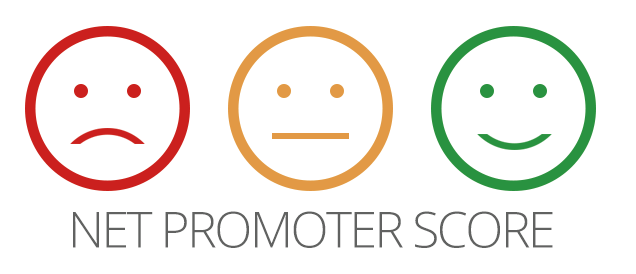
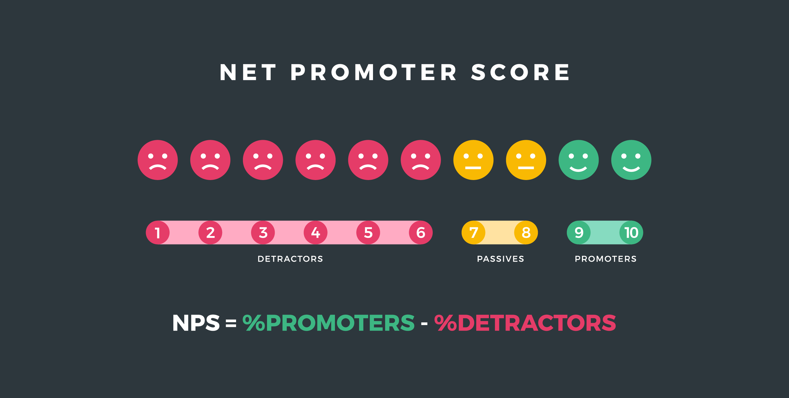

<div align="center">
    
</div>

<h4 align="center">
  <strong> 
  🚀 Desenvolvido durante a Next Level Week 4.0 🚀
  </strong>
</h4>



## 💻 Projeto
<p>
   Net Promoter Score - O NPS tem como objetivo melhorar o desempenho da empresa com base no feedback dos usuários.
</p>

## 	👧 💻 Instrutora - [Rocketseat](https://rocketseat.com.br/)  

 
  [Daniele Leão Evangelista](https://www.linkedin.com/in/daniele-le%C3%A3o-evangelista-5540ab25/) - Trilha NodeJS 
  
  ## 🚀 Tecnologias

  Esse projeto foi desenvolvido com as seguintes tecnologias:
- [Typescript](https://www.typescriptlang.org/)
- [Node.js](https://nodejs.org/en/)
- [Express](https://expressjs.com/pt-br/)
- [Yarn](https://yarnpkg.com/)

 
### 📋 Faça um clone:

```sh
  $ git clone https://github.com/vinive/nps-api
```
  

## 🤔 Como contribuir

- Faça um fork desse repositório;
- Cria uma branch com a sua feature: `git checkout -b minha-feature`;
- Faça commit das suas alterações: `git commit -m 'feat: Minha nova feature'`;
- Faça push para a sua branch: `git push origin minha-feature`.

## 📝 Licença

Esse projeto está sob a licença MIT. Veja o arquivo [LICENSE](LICENSE.md) para mais detalhes.

---

<p align="center">Desenvolvido por Vinicius 👨‍🚀 </p>
